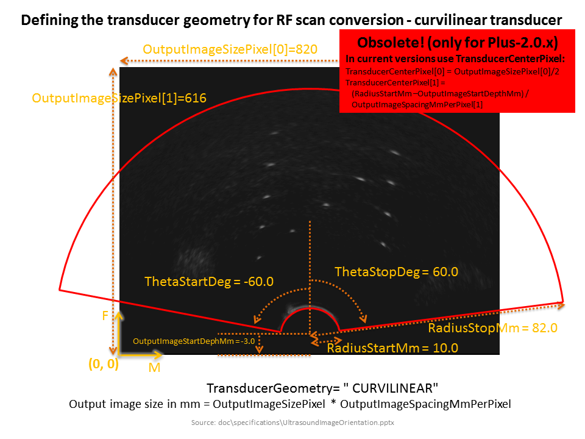

# RF processing algorithm

This algorithm can convert RF data to B-mode images. The conversion is performed in two steps:
- Brightness conversion: the RF samples converted to brightness values
- Scan conversion: RF lines are pasted into an image according to the defined transducer geometry.
To convert recorded RF data to B-mode use the `ApplicationRfProcessor`.

Information on transducer geometry can be obtained from the probe manufacturer.
If the manufacturer does not disclose all necessary information or to verify the transducer geometry:
acquire a B-mode and an RF-mode frame of the same object and compare the received B-mode image to the
B-mode image that RfProcessor constructed from the received RF frame

## Configuration settings

- **RfProcessing**
    - **RfToBrightnessConversion**
        - **NumberOfHilbertFilterCoeffs**
        - **BrightnessScale**
    - **ScanConversion**
        - **TransducerName**
        - **TransducerGeometry**
        - **RadiusStartMm**
        - **RadiusStopMm**
        - **ThetaStartDeg**
        - **ThetaStopDeg**
        - **OutputImageStartDepthMm**
        - **ImagingDepthMm**
        - **TransducerWidthMm**
        - **OutputImageSizePixel**
        - **OutputImageSpacingMmPerPixel**
        - **TransducerCenterPixel**

