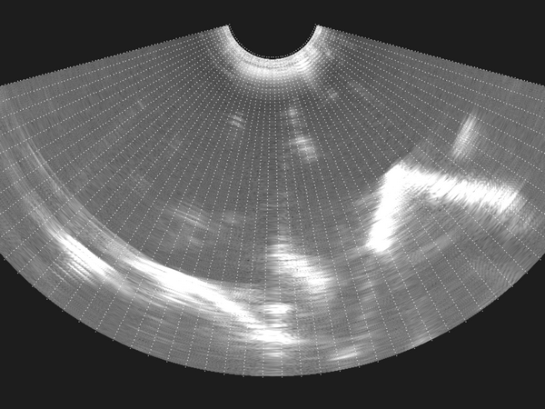

# Draw scanlines (DrawScanLines)

This is a command-line tool for drawing scan lines over brightness images.
Scan line parameters are read from ScanConversion element of the device set configuration file.

## Examples

    DrawScanlines --config-file=PlusConfiguration_ImageProcessingAlgoTest.xml --config-file=PlusDeviceSet_ImageProcessingAlgoCurvilinearTest.xml --source-seq-file=UltrasonixCurvilinearScanConvertedData.mha --output-seq-file=UltrasonixCurvilinearScanConvertedDataWithScanlines.mha

## Command-line parameters reference

\verbinclude "DrawScanLinesHelp.txt"