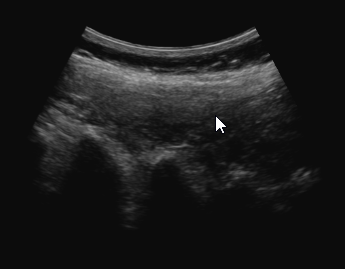

# Extract scan lines (ExtractScanLines)

This is a command-line tool for extracting scan lines from B-mode images. The output frames only contain pixels along the input scan lines. The output images are rectangular, regardless of the input image geometry.
Scan line parameters are read from ScanConversion element of the device set configuration file.

This is an example input image from SpineUltrasound-Lumbar-C5.mha (in PlusLibData/TestImages folder)

This is the corresponding output image after scan line extraction

## Examples

    ExtractScanLines
    --config-file=SpineUltrasound-Lumbar-C5_config.xml
    --input-seq-file=SpineUltrasound-Lumbar-C5.mha 
    --output-seq-file=SpineUltrasound-Lumbar-C5_ScanLines.mha

## Command-line parameters reference

\verbinclude "ExtractScanLinesHelp.txt"