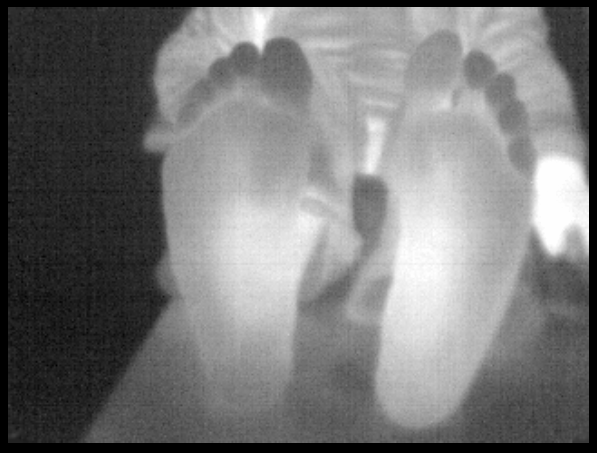

# Thermal Infrared Seek Pro camera

## This device allow you to use a Infrared Seek Pro Camera to capture and send infrared thermal images.



## To use the camera in a linux system, you have to grant privileges to write to it. We have made a small
script that you may execute with root privileges that only needs to be run once. This script adds a new
udev rule to be able to run the library for the camera as a non root user (The rule can be found at
"PlusLib/src/Utilities/InfraredSeekCamera/seekcam.rules", where 0011 is the Seek Thermal CompactPRO model).
For Windows, only the WinUSB driver is needed. You can find the instructions to install the camera, as well
as how to use the configuration file in: <https://github.com/PlusToolkit/PlusLib/tree/master/src/Utilities/InfraredSeekCamera>

## Device configuration settings

  - **Type**: `InfraredSeekCam`
  - **DataSources**: Exactly one `DataSource` child element is required. (Required)
     - **DataSource**: (Required)
      - **PortUsImageOrientation**: (Required)

## Example configuration file PlusDeviceSet_Server_InfraredSeekCamera.xml

```xml
<PlusConfiguration version="2.1">

 <DataCollection StartupDelaySec="1.0" >
   <DeviceSet
     Name="PlusServer: Infrared Seek Camera"
     Description="Infrared Seek Camera"
   />
   <Device
     Id="VideoDevice"
     Type="InfraredSeekCam"
     CameraType="Pro"
     FlatFile="flatfile.bin"
     BiasFile="biasfile.bin"
     CalibrateTemperature="true"
     TemperatureMultiplier="0.022174"
     TemperatureBias="322.56">
     <DataSources>
       <DataSource Type="Video" Id="Video" PortUsImageOrientation="UF"  />
     </DataSources>
     <OutputChannels>
       <OutputChannel Id="VideoStream" VideoDataSourceId="Video" />
     </OutputChannels>
   </Device>
 </DataCollection>

 <CoordinateDefinitions>
   <Transform From="Image" To="Reference"
     Matrix="
       1 0 0 0
       0 1 0 0
       0 0 1 0
       0 0 0 1" />
 </CoordinateDefinitions>

 <PlusOpenIGTLinkServer
   MaxNumberOfIgtlMessagesToSend="1"
   MaxTimeSpentWithProcessingMs="50"
   ListeningPort="18944"
   SendValidTransformsOnly="true"
   OutputChannelId="VideoStream" >
   <DefaultClientInfo>
     <MessageTypes>
       <Message Type="IMAGE" />
     </MessageTypes>
     <ImageNames>
       <Image Name="Image" EmbeddedTransformToFrame="Reference" />
     </ImageNames>
   </DefaultClientInfo>
 </PlusOpenIGTLinkServer>

</PlusConfiguration>
```