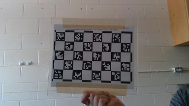

# Optical Marker Tracker

OpticalMarkerTracker is virtual device that provides position tracking of markers using any webcam or camcorder. You can print your own markers on any regular printer and attach to a flat surface on an object. The device uses algorithms implemented in OpenCV and ArUco software libraries.

## Supported hardware devices

- This is a virtual (software-only) device, which uses images taken by any optical imaging device that Plus supports, such as external webcam, built-in laptop camera - either forward or rear facing, camcorder connected through framegrabber, etc.

## Supported platforms

- This device can be used in combination with any device in Plus that provides a video stream. Most frequently it is used with Microsoft Media Foundation devices (webcams, framegrabbers).

## Installation

To get started, print a set of markers and create a configuration file. It is recommended to use "PlusServer: Optical marker tracker using MMF video" configuration file that is included in your Plus installation package (see also at the bottom of this page) and print this sheet that contains a number of markers with different sizes (make sure to print in actual size: scaling should be 100%):
[marker_sheet_36h12.pdf](https://github.com/PlusToolkit/PlusLibData/raw/master/ConfigFiles/OpticalMarkerTracker/marker_sheet_36h12.pdf). If you put the sheet in the field of view of your camera, the device will detect position and orientation of the markers.

To improve tracking accuracy, you need to create a calibration file for your camera as described below.  If you need more tracking markers, you can print more by following instructions below.

### Calibration

Camera calibration determines optical properties of your camera (distortion, focal length, etc) to improve tracking accuracy.

***WARNING: Camera calibration uses an external application, which uses meters as unit for length. This is the ONLY place length should be specified in meters.  Everywhere else in Plus it is millimeter.***

- Print the [aruco calibration chessboard](https://github.com/PlusToolkit/PlusLibData/blob/master/ConfigFiles/OpticalMarkerTracker/aruco_calibration_board_a4.pdf) and measure the side length of the markers.
- To generate a calibration file, run `aruco_calibration.exe`
  Example:
  ```console
  aruco_calibration.exe live:0 camera_calibration.yml -size 0.03556
  ```
  Reference:
  ```console
  aruco_calibration.exe live:<camera-index> <output-file-name>.yml -size <marker-size-m>
  ```
  where:
    - `camera-index` is the integer index of the camera you want to use (usually 0 or 1).
    - `output-file-name` is the desired output file name.
    - `marker-size-m` is the size of a marker side in meters.
- With the video window selected (keyboard shortcuts will not work while the command line window is selected):
  - Press **a** to capture image and add to the calibration image set.
  - Press **c** to run calibration on the captured images. (`repj`) is a measure of the calibration error (normal is < 1).
  - Press **s** to stop calibration.

- For best results use at least 6 images including:
  - At least one frontal image.

    

  - Multiple images where the border of the chessboard is near the top or side image border.

    

  - Multiple images where the chessboard is held at an oblique angle to the camera.

    
    

### Creating printable marker images
- A premade sheet of ARUCO_36h12 markers in three standard sizes (80mm, 50mm, and 30mm) is located at
  [/ConfigFiles/OpticalMarkerTracker/marker_sheet_36h12.pdf](https://github.com/PlusToolkit/PlusLibData/blob/master/ConfigFiles/OpticalMarkerTracker/marker_sheet_36h12.pdf).
- Some pre-generated marker images from the ARUCO_MIP_36h12 dictionary are included at
  [/ConfigFiles/OpticalMarkerTracker/markers](https://github.com/PlusToolkit/PlusLibData/tree/master/ConfigFiles/OpticalMarkerTracker/markers).

- To generate a **single** **image** for printing, run aruco_print_marker.exe
  Example:
  ```console
  aruco_print_marker.exe 0 marker0.png -bs 75 -d ARUCO_MIP_36h12
  ```
  Reference:
  ```console
  aruco_print_marker.exe <marker-id> <output-file-name>(.jpg|.png|.ppm|.bmp) -bs <bit-size> -d <dictionary>
  ```
  where:
      - `marker-id` is the integer ID of the marker you wish to print.
      - `output-file-name` is the desired marker image filename.
      - `bit-size` is the number of pixels per interior image bit (Optional, default: 50px).
      - `dictionary` is the marker dictionary you wish to use (we suggest ARUCO_MIP_36h12).

- To generate printable markers for an **entire** **dictionary** at once, run aruco_print_dictionary.exe
  Example:
  ```console
  aruco_print_dictionary.exe markers_36h12 ARUCO_MIP_36h12 -s 75
  ```
  Reference:
  ```console
  aruco_print_dictionary.exe <output-directory> <dictionary> -s <bit-size>
  ```
  where:
      - `output-directory` is the directory to output the marker images to (must already exist).
      - `dictionary` is the marker dictionary you wish to use (we suggest ARUCO_MIP_36h12).
      - `bit-size` is the number of pixels per interior image bit (Optional, default: 75px).

## Device configuration settings
- Calibration files can be generated as above, under Calibration.
- An example calibration file generated using a RealSense Gen2 camera unit is found at [/ConfigFiles/OpticalMarkerTracker/realsense_gen2_calibration.yml](https://github.com/PlusToolkit/PlusLibData/blob/master/ConfigFiles/OpticalMarkerTracker/realsense_gen2_calibration.yml)
- The creation of a custom calibration file for your camera is **strongly** recommended.  Failure to do so can result in erroneous and/or unstable measurements.
  - **Type**: `OpticalMarkerTracker`
  - **CameraCalibrationFile**: Camera calibration file containing device-specific parameters measured by the camera calibration utility. Path is relative to `FileApplicationConfiguration` (`DeviceSetConfigurationDirectory`).
  - **ToolReferenceFrame**: (Optional, default: `Tracker`)
  - **TrackingMethod**: Tracking method.
      - `OPTICAL` uses just RGB video.
      - `OPTICAL_AND_DEPTH` uses depth data and RGB video (work in progress).
  - **MarkerDictionary**: The dictionary whose markers are being used.
      - `ARUCO_MIP_36h12` Use of this dictionary is recommended. Some pre-generated marker images are included at [/ConfigFiles/OpticalMarkerTracker/markers](https://github.com/PlusToolkit/PlusLibData/tree/master/ConfigFiles/OpticalMarkerTracker/markers).
      - `ARUCO`
      - `ARUCO_MIP_16h3`
      - `ARUCO_MIP_25h7`
      - `ARTAG`
      - `ARTOOLKITPLUS`
      - `ARTOOLKITPLUSBCH`
      - `TAG16h5`
      - `TAG25h7`
      - `TAG25h9`
      - `TAG36h10`
      - `TAG36h11`
  - **DataSources**: (Required)
      - **DataSource**: (Required)
          - **MarkerId**: The integer identifier of the marker representing this tool.
          - **MarkerSizeMm**: The size of the marker in mm

## Example configuration file PlusDeviceSet_Server_OpticalMarkerTracker_Mmf.xml

This configuration file can be used with this example 3D Slicer scene: [OpticalMarkerTracker_Scene.mrb](https://github.com/PlusToolkit/PlusLibData/raw/master/ConfigFiles/OpticalMarkerTracker/OpticalMarkerTracker_Scene.mrb)

```xml
<PlusConfiguration version="2.4">
  <DataCollection StartupDelaySec="1.0" >
    <DeviceSet
      Name="PlusServer: Optical marker tracker using MMF video"
      Description="Tracking of printed ArUco markers using a simple camera. Marker positions and image data are broadcasted through OpenIGTLink (on port 18944 and 18945, respectively). To use a different camera, change CaptureDeviceId attribute (to 0, 1, 2, ...)." />
    <Device
      Id="VideoDevice"
      Type="MmfVideo"
      FrameSize="640 480"
      VideoFormat="YUY2"
      CaptureDeviceId="1" >
      <DataSources>
        <DataSource Type="Video" Id="Video" PortUsImageOrientation="MF" ImageType="RGB_COLOR" />
      </DataSources>
      <OutputChannels>
        <OutputChannel Id="VideoStream" VideoDataSourceId="Video" />
      </OutputChannels>
    </Device>
    <Device
      Id="TrackerDevice"
      Type="OpticalMarkerTracker"
      CameraCalibrationFile="OpticalMarkerTracker/realsense_gen2_calibration.yml"
      ToolReferenceFrame="Tracker"
      TrackingMethod="OPTICAL"
      MarkerDictionary="ARUCO_MIP_36h12">
      <DataSources>
        <DataSource Type="Tool" Id="Marker0" MarkerId="0" MarkerSizeMm="80" />
        <DataSource Type="Tool" Id="Marker1" MarkerId="1" MarkerSizeMm="80" />
        <DataSource Type="Tool" Id="Marker2" MarkerId="2" MarkerSizeMm="50" />
        <DataSource Type="Tool" Id="Marker3" MarkerId="3" MarkerSizeMm="50" />
        <DataSource Type="Tool" Id="Marker4" MarkerId="4" MarkerSizeMm="50" />
        <DataSource Type="Tool" Id="Marker5" MarkerId="5" MarkerSizeMm="30" />
        <DataSource Type="Tool" Id="Marker6" MarkerId="6" MarkerSizeMm="30" />
        <DataSource Type="Tool" Id="Marker7" MarkerId="7" MarkerSizeMm="30" />
        <DataSource Type="Tool" Id="Marker8" MarkerId="8" MarkerSizeMm="30" />
      </DataSources>
      <InputChannels>
        <InputChannel Id="VideoStream"  />
      </InputChannels>
      <OutputChannels>
        <OutputChannel Id="TrackerStream" >
          <DataSource Id="Marker0"/>
          <DataSource Id="Marker1"/>
          <DataSource Id="Marker2"/>
          <DataSource Id="Marker3"/>
          <DataSource Id="Marker4"/>
          <DataSource Id="Marker5"/>
          <DataSource Id="Marker6"/>
          <DataSource Id="Marker7"/>
          <DataSource Id="Marker8"/>
        </OutputChannel>
      </OutputChannels>
    </Device>
    <Device
      Id="CaptureDevice"
      Type="VirtualCapture"
      BaseFilename="RecordingTest.igs.mha"
      EnableCapturingOnStart="FALSE" >
      <InputChannels>
        <InputChannel Id="TrackerStream" />
      </InputChannels>
    </Device>
  </DataCollection>

  <PlusOpenIGTLinkServer
    MaxNumberOfIgtlMessagesToSend="1"
    MaxTimeSpentWithProcessingMs="50"
    ListeningPort="18944"
    SendValidTransformsOnly="true"
    OutputChannelId="TrackerStream" >
    <DefaultClientInfo>
      <MessageTypes>
        <Message Type="TRANSFORM" />
      </MessageTypes>
      <TransformNames>
        <Transform Name="Marker0ToTracker" />
        <Transform Name="Marker1ToTracker" />
        <Transform Name="Marker2ToTracker" />
        <Transform Name="Marker3ToTracker" />
        <Transform Name="Marker4ToTracker" />
        <Transform Name="Marker5ToTracker" />
        <Transform Name="Marker6ToTracker" />
        <Transform Name="Marker7ToTracker" />
        <Transform Name="Marker8ToTracker" />
      </TransformNames>
    </DefaultClientInfo>
  </PlusOpenIGTLinkServer>

  <PlusOpenIGTLinkServer
    MaxNumberOfIgtlMessagesToSend="1"
    MaxTimeSpentWithProcessingMs="50"
    ListeningPort="18945"
    SendValidTransformsOnly="true"
    OutputChannelId="VideoStream" >
    <DefaultClientInfo>
      <MessageTypes>
        <Message Type="IMAGE" />
      </MessageTypes>
      <ImageNames>
        <Image Name="Image" EmbeddedTransformToFrame="Image" />
      </ImageNames>
    </DefaultClientInfo>
  </PlusOpenIGTLinkServer>

</PlusConfiguration>
```